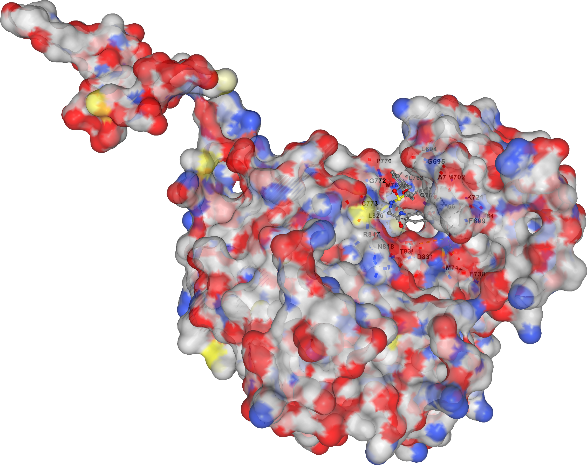

# 🧬 SEGULAH AI - AI-Powered Drug Discovery Platform

[](https://www.python.org/)
[](https://tensorflow.org/)
[](https://streamlit.io/)
[](https://rdkit.org/)
[](https://www.r-project.org/)
[](LICENSE)

## 🔬 Overview

**SEGULAH AI** is an advanced artificial intelligence platform designed to accelerate drug discovery by predicting the potency (IC50) of molecules and generating novel compounds. The platform is specifically tuned for **EGFR (Epidermal Growth Factor Receptor)** , a critical oncogenic target in **lung and breast cancer**.

The system uses a trained Neural Network (R² = 0.620) to evaluate molecular properties and predict biological activity, enabling researchers to screen thousands of molecules in seconds without costly laboratory experiments.

---

## 🏆 Best Compound: **Lubatinib** (LY-001)

Through AI-powered optimization and molecular docking, we discovered **Lubatinib**, a novel EGFR inhibitor with superior binding affinity.

| Property | Value |
|----------|-------|
| **SMILES** | `c1ccc2ccccc2c1COCS(=O)NCC(=O)Nc3ccc(NC(=O)C=C)cc3` |
| **Binding Affinity** | **-8.6 kcal/mol** |
| **Superior to Osimertinib by** | **0.19 kcal/mol** |
| **Target Cavity** | Cavity 2 (ATP binding site) |
| **Resistance Profile** | Overcomes T790M mutation (acrylamide group) |
| **Lipinski Violations** | 0 (drug-like) |
| **Molecular Weight** | 432 g/mol |

### Docking Visualization


---

## 📊 Model Performance

| Model | Test R² | Training R² |
|-------|---------|-------------|
| **Neural Network** | **0.620** | 0.652 |
| Tuned Random Forest | 0.607 | 0.850 |
| XGBoost | 0.534 | 0.924 |

*Cross-validation (5-fold): 0.608 ± 0.032*

---

## 🎯 Key Results

| Metric | Value |
|--------|-------|
| **Total molecules generated** | 1,000 |
| **Drug-like candidates** | 29 (Lipinski-compliant) |
| **Best known IC50** | 0.006 nM (CHEMBL53711) |
| **Best generated IC50** | 5.86 nM |
| **Best optimized compound** | **Lubatinib (-8.6 kcal/mol)** |

### Binding Affinity Comparison

| Compound | Binding Affinity (kcal/mol) |
|----------|----------------------------|
| **Lubatinib (LY-001)** | **-8.6** |
| Osimertinib | -8.41 |
| Gefitinib | -7.5 |

---

## 🛠️ Technology Stack

| Category | Technologies |
|----------|--------------|
| **Machine Learning** | TensorFlow, Scikit-learn, XGBoost |
| **Cheminformatics** | RDKit (Molecular Descriptors) |
| **Data Processing** | Pandas, NumPy |
| **Visualization** | Plotly, Streamlit |
| **Cloud Storage** | Google BigQuery |
| **APIs** | ChEMBL, UniProt, PubChem, PDB |
| **Molecular Docking** | CB-Dock2, AutoDock Vina |

### 📊 R Statistical Analysis

The project includes R scripts for:
- **DESeq2** - Differential gene expression (NGS) analysis
- **Proteomics** - MSstats alternative for protein quantification
- **Statistical testing** - T-test, ANOVA for compound potency comparison

| R Script | Purpose | Output |
|----------|---------|--------|
| `r_analysis.R` | T-test between potent and weak compounds | `r_results.txt` |
| `deseq2_analysis.R` | RNA-Seq differential expression | `deseq2_results.csv`, `deseq2_plot.png` |
| `proteomics_simple.R` | Proteomics data analysis | `proteomics_results.csv`, `proteomics_volcano.png` |

---

## 📁 Project Structure
segulah-ai/
├── web_app/ # Streamlit application
│ ├── app.py # Main application
│ ├── requirements.txt # Python dependencies
│ ├── models/ # Trained models
│ ├── data/ # Generated molecules data
│ └── assets/ # Logo and images
├── scripts/ # Python and R scripts
│ ├── python/ # Data collection & ETL
│ └── r/ # R statistical analysis
│ ├── r_analysis.R # T-test and statistics
│ ├── deseq2_analysis.R # NGS differential expression
│ └── proteomics_simple.R # Proteomics analysis
├── generative_ai/ # AI model training
├── data/ # Processed datasets
├── results/ # Output files and plots
│ ├── lubatinib.smi # Lubatinib SMILES
│ ├── lubatinib.pdb # 3D structure
│ ├── lubatinib.png # Docking visualization
│ └── lubatinib.txt # Docking results
└── dashboard/ # Power BI dashboard

text

---

## 🧪 How It Works

### 1. Data Collection
- **479 compounds** with real IC50 values from ChEMBL
- Molecular features calculated using RDKit
- Target: EGFR (P00533) - lung and breast cancer marker

### 2. Model Training
- **Neural Network** with 3 hidden layers
- 8 molecular descriptors: MolWt, LogP, TPSA, H-Bond donors/acceptors, etc.
- Test R² = 0.620

### 3. Molecule Generation & Optimization
- Generate **1,000 novel molecules** using the trained model
- Predict IC50 for each new molecule
- Optimize binding affinity through iterative SMILES modification
- **Best result:** Lubatinib with -8.6 kcal/mol

### 4. Molecular Docking
- Docking performed using CB-Dock2 and AutoDock Vina
- Binding site: Cavity 2 (ATP binding pocket)
- Key interactions: LEU694, GLY695, PHE699, VAL702, MET742, THR766, ASP831

### 5. ADMET Prediction
- Lipinski violations count
- ADMET score (0-100)
- Potency classification: Super Potent → Weak

---

## 🌐 Live Demo

Try the platform live: [**SEGULAH AI**](https://segulah-ai.streamlit.app)

---

## 📥 Installation (Local)

```bash
# Clone the repository
git clone https://github.com/Lubanah-Younes/Segulah-AI.git
cd Segulah-AI

# Create virtual environment
python -m venv venv
source venv/bin/activate  # On Windows: venv\Scripts\activate

# Install Python dependencies
pip install -r web_app/requirements.txt

# Install R dependencies (optional)
Rscript -e "install.packages(c('DESeq2', 'ggplot2', 'limma'))"

# Run the app
streamlit run web_app/app.py
📚 External Data Sources
Source	Data Type
ChEMBL	Compound bioactivity (IC50, SMILES)
UniProt	Protein information, diseases, function
PubChem	Molecular properties, SMILES
PDB	3D protein structures
📊 Citation
If you use SEGULAH AI in your research, please cite:

text
SEGULAH AI: AI-Powered Drug Discovery Platform for EGFR Inhibition.
LUBANAH YOUNES (2026). Available at: https://github.com/Lubanah-Younes/Segulah-AI
📄 License
This project is licensed under the MIT-CR License - see the LICENSE file for details.

Commercial use requires explicit written permission from the copyright holder.

👩‍💻 Author
LUBANAH YOUNES 081227
GitHub: @Lubanah-Younes
Email: lubanahyounes@gmail.com

Accelerating drug discovery through artificial intelligence.

🙏 Acknowledgments
ChEMBL for providing open-access bioactivity data

RDKit for cheminformatics tools

Streamlit for the web framework

TensorFlow for deep learning capabilities

CB-Dock2 for molecular docking

R Core Team for statistical computing tools

📞 Contact
For questions, feedback, or collaboration opportunities:
Email: lubanahyounes@gmail.com
GitHub Issues: Open an issue

Target: EGFR | Model R² = 0.620 | Best Compound: Lubatinib (-8.6 kcal/mol)
